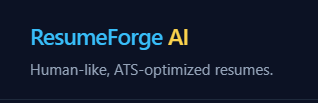
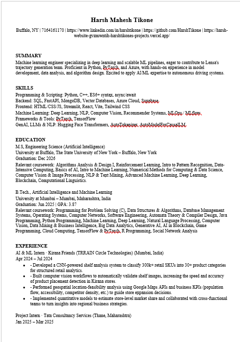
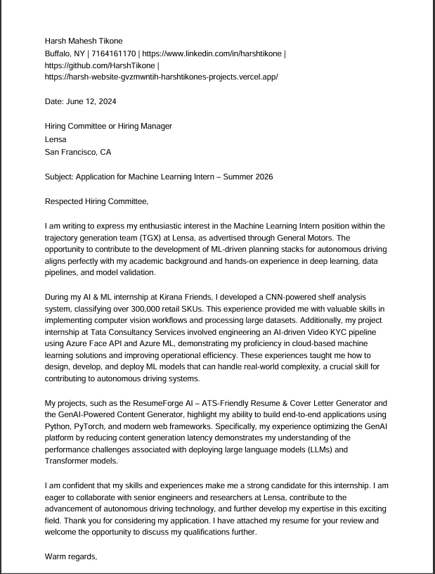
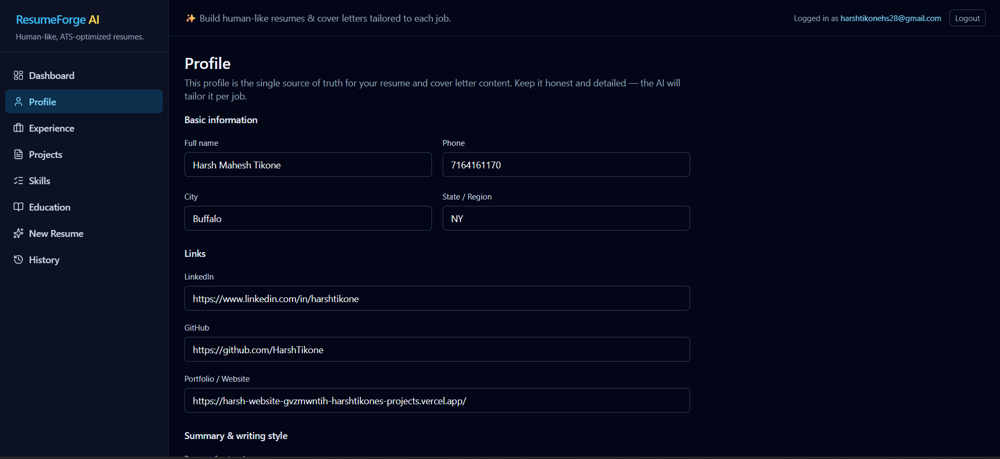
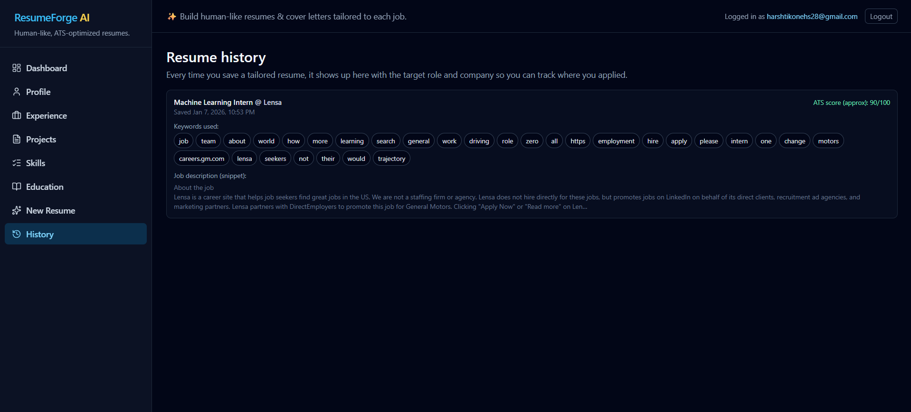

# ResumeForge AI




An **AI-first resume & cover-letter generator** that uses **Google Gemini** to turn your structured profile into an ATS-friendly, role-targeted application package.

Unlike typical “resume builders” that focus on templates, ResumeForge AI is built around an **LLM workflow**:

* Understand a **job description**
* Select the **most relevant** experiences/projects from your profile
* Use **Gemini** to rewrite content in a natural, recruiter-ready style
* Export to **DOCX/PDF** and save versions to track applications

---

## Demo

**Deployment status: local-only.** The current secure Gemini integration uses a Vite
development-server proxy, so this repository intentionally does not claim a public deployment.
The screenshots below show the implemented workflow. A hosted version requires moving the same
`/api/generate` handler to a serverless function or backend service.

## Screenshots

| New Resume (JD → Tailored Output) | Cover Letter |
| --- | --- |
|  |  |


| Profile (Single Source of Truth)    | History (Track Applications)        |
| ----------------------------------- | ----------------------------------- |
|  |  |

---

## Why This Is an AI Project (Not Just Full‑Stack)

ResumeForge AI is designed as a **grounded generation system**:

* Your profile data is the **truth source**
* The LLM is used for **rewriting + structuring**, not inventing content
* Output follows **ATS-safe constraints** and a consistent formatting policy
* The pipeline supports iteration: improve matching logic, prompts, and evaluation over time

---

## Core AI Capabilities

### 1) Job Description Understanding

* Extracts key skills, tools, responsibilities, and role signals from the JD
* Normalizes terms (e.g., “ML Ops” → “MLOps”, “CI/CD” → “continuous integration”) to improve matching

### 2) Relevance Ranking (Auto-Pick Best Matches)

* Computes relevance between JD keywords and:

  * experience bullets
  * projects
  * skills
  * coursework
* Auto-selects top matches so the generated resume stays focused and concise

### 3) Gemini-Powered Rewrite (Humanize & Optimize)

Uses **Google Gemini** to:

* strengthen bullets (action verbs, clarity, impact)
* reduce repetition and improve readability
* align wording to the JD while staying truthful to your inputs
* maintain ATS-friendly formatting (clean sections, consistent structure)

### 4) Cover Letter Generation

* Generates a job-specific cover letter using the same selected experiences/projects
* Keeps tone professional and grounded (no exaggerated claims)

### 5) Guardrails & Grounding

* Prompts enforce: **no invented experience**, no fake metrics, no made-up tools
* Output follows style constraints for ATS parsing (simple formatting, clear headings)

---

## AI Workflow (High Level)

```text
JD (paste) ──► JD Parser ──► Keywords + role signals
                    │
                    ▼
Profile (truth) ─► Relevance Ranker ─► Selected experiences/projects/skills
                    │
                    ▼
            Gemini Rewrite + Structuring
                    │
                    ▼
           Resume + Cover Letter (ATS-safe)
                    │
                    ├─► Export: TXT / DOCX / PDF
                    └─► Save to History (track applications)
```

---

## Tech Stack (Supporting the AI Workflow)

* **Frontend:** React + Vite
* **UI:** Tailwind CSS
* **State:** Zustand (`src/store`)
* **Auth + Database:** Supabase (`src/lib/supabaseClient.js`)
* **LLM Provider:** **Google Gemini** through a server-only Vite development proxy

---

## Project Structure

```txt
src/
  lib/
    aiClient.js            # same-origin client for the secure /api/generate route
    supabaseClient.js      # Auth + database
  pages/
    AuthPage.jsx
    DashboardPage.jsx
    ProfilePage.jsx        # single source of truth
    ExperiencePage.jsx
    ProjectsPage.jsx
    SkillsPage.jsx
    EducationPage.jsx
    NewResumePage.jsx      # JD → analyze → select → generate
    ResumeHistoryPage.jsx  # saved versions per role/company
  store/
    useAuthStore.js
  App.jsx
  main.jsx
vite.config.js             # server-only Gemini proxy for local development
```

---

## Getting Started (Local)

### Prerequisites

* Node.js 18+ recommended
* npm (or pnpm/yarn)

### Install

```bash
npm install
```

### Environment Variables

Create a `.env.local` file in the project root.

**Example (`.env.example`):**

```env
# Supabase
VITE_SUPABASE_URL=your_supabase_url
VITE_SUPABASE_ANON_KEY=your_supabase_anon_key

# Gemini — server-only; never prefix these with VITE_
GEMINI_API_KEY=your_gemini_api_key
GEMINI_MODEL=gemini-2.0-flash
```

### Run

```bash
npm run dev
```

Open: [http://localhost:5173](http://localhost:5173)

---

## Security Notes (Important)

* The browser calls only the same-origin `/api/generate` route. `GEMINI_API_KEY` is read by
  `vite.config.js` on the server and is never included in the frontend bundle or request URL.
* `.env`, `.env.local`, and dependency/build directories are ignored by Git. Only
  `.env.example` is committed.
* Before a public deployment, move the proxy handler to a protected serverless function or backend;
  a static Vite deployment alone cannot safely hold the Gemini key.
* Resume data is sensitive — treat logs and stored data carefully.

---

## Evaluation (Suggested)

If you want to formalize quality:

* **Keyword coverage:** % of JD keywords reflected in the final resume
* **Readability:** reduce redundancy, improve clarity
* **Latency:** time from “Generate” to final output
* **Truthfulness checks:** ensure outputs only use profile-provided facts

---

## Roadmap

* Better relevance ranking: embeddings + reranking
* Prompt versioning + A/B testing
* Resume templates (ATS-safe variants)
* Per-application profile snapshots
* “No-hallucination” verifier step before export

---

## Author

**Harsh Mahesh Tikone**

* [LinkedIn](https://www.linkedin.com/in/harshtikone/)
* [GitHub](https://github.com/HarshTikone)
